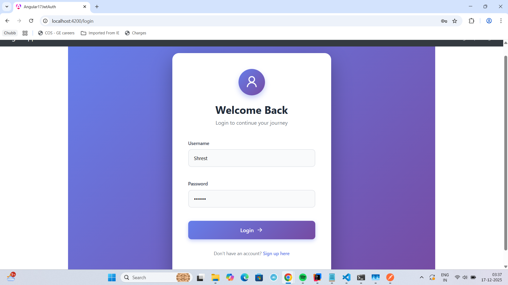
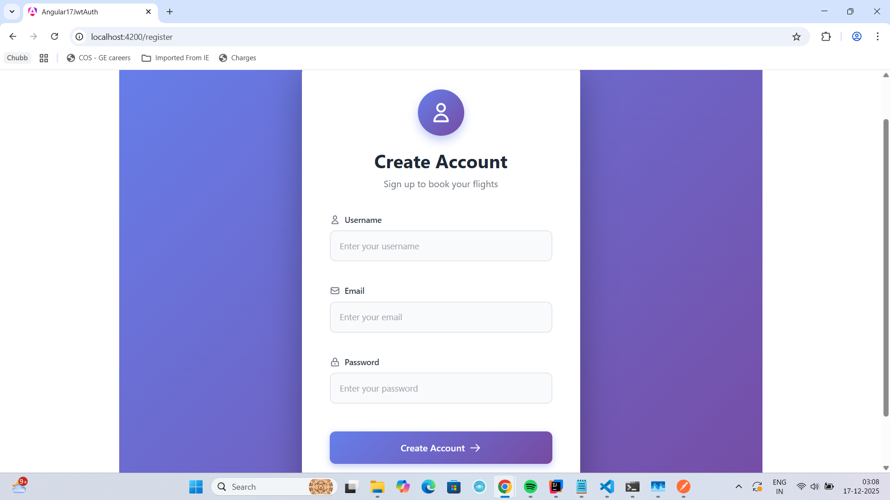
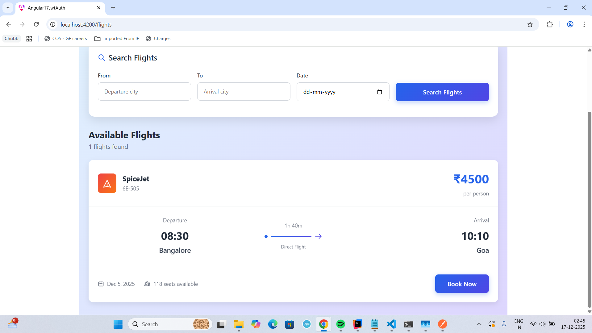

# Frontend Application for Dockerized Microservices

## Overview
This repository contains the frontend application for a microservices-based system.
The frontend communicates with Dockerized backend microservices via an API Gateway,
ensuring scalability and clean architecture.

---

## Architecture
The frontend interacts only with the API Gateway. The gateway routes requests
to the appropriate backend microservices.

Flights : localhost:4200/flights
Signup: localhost:4200/register
Signin: localhost:4200/login
Backend Apigateway endpoint : localhost:8085

## 📸 Application Screenshots

### 🔐 Sign In Page

---

### 📝 Sign Up Page

---

### ✈️ Flights Page

### Backend (Integrated)
- Spring Boot Microservices
- Spring Cloud Gateway
- Eureka Service Discovery

## Tech Stack

### Frontend
- Angular
- TypeScript
- HTML5, CSS3

### DevOps
- Docker
- Docker Compose

# Angular17JwtAuth

This project was generated with [Angular CLI](https://github.com/angular/angular-cli) version 17.3.17.

## Development server

Run `ng serve` for a dev server. Navigate to `http://localhost:4200/`. The application will automatically reload if you change any of the source files.

## Code scaffolding

Run `ng generate component component-name` to generate a new component. You can also use `ng generate directive|pipe|service|class|guard|interface|enum|module`.

## Build

Run `ng build` to build the project. The build artifacts will be stored in the `dist/` directory.

## Running unit tests

Run `ng test` to execute the unit tests via [Karma](https://karma-runner.github.io).

## Running end-to-end tests

Run `ng e2e` to execute the end-to-end tests via a platform of your choice. To use this command, you need to first add a package that implements end-to-end testing capabilities.

## Further help

To get more help on the Angular CLI use `ng help` or go check out the [Angular CLI Overview and Command Reference](https://angular.io/cli) page.
